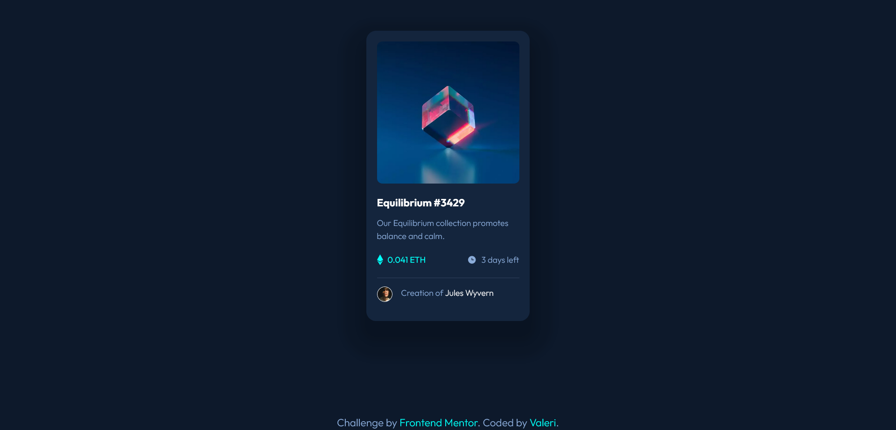

# Frontend Mentor - NFT preview card component solution

This is a solution to the [NFT preview card component challenge on Frontend Mentor](https://www.frontendmentor.io/challenges/nft-preview-card-component-SbdUL_w0U). Frontend Mentor challenges help you improve your coding skills by building realistic projects.

## Table of contents

-   [Overview](#overview)
    -   [The challenge](#the-challenge)
    -   [Screenshot](#screenshot)
    -   [Links](#links)
-   [My process](#my-process)
    -   [Built with](#built-with)
    -   [Useful resources](#useful-resources)
-   [Author](#author)
-   [Acknowledgments](#acknowledgments)

## Overview

### The challenge

Users should be able to:

-   View the optimal layout depending on their device's screen size
-   See hover states for interactive elements

### Screenshot

### Links

-   Solution URL: [Add solution URL here](https://your-solution-url.com)
-   Live Site URL: [Add live site URL here](https://your-live-site-url.com)

## My process

### Built with

-   Semantic HTML5 markup
-   CSS custom properties
-   Flexbox
-   CSS Grid
-   Mobile-first workflow

### Useful resources

-   [autoprefixer](https://www.npmjs.com/package/autoprefixer) - PostCSS plugin to parse CSS and add vendor prefixes to CSS rules using values from Can I Use.
-   [ttf2woff](https://www.npmjs.com/package/ttf2woff) - npm package helped me convert fonts from ttf format to woff.
-   [ttf2woff2](https://www.npmjs.com/package/ttf2woff2) - npm package helped me convert fonts from ttf format to woff2.
-   Convert ttf2woff2 from powershell:
-   `start-process -nnw -wait ttf2woff2.cmd -rsi fonts/Outfit-Light.ttf -rso fonts/Outfit-Light.woff2`
-   Regular and Bold styles copied from previous [QR Code Component](https://github.com/Valeri85/QR-code-component) challenge.
-   [webp-converter-cli](https://www.npmjs.com/package/webp-converter-cli) The CommandLine tool for converting jpg or png files to webp, recursively.
-   [group-css-media-queries](https://www.npmjs.com/package/group-css-media-queries) CSS postprocessing: group media queries.

## Author

-   Frontend Mentor - [@Valeri85](https://www.frontendmentor.io/profile/Valeri85)
-   Twitter - [@Valeri](https://www.twitter.com/Valeri79125128)
